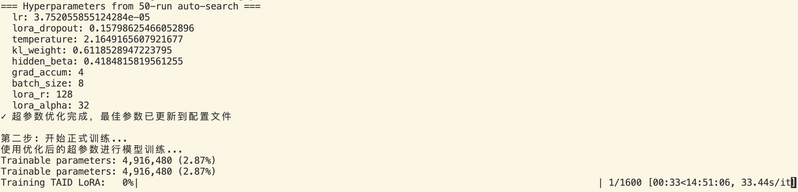

# ASR Knowledge Distillation Project

TBD

## Project Structure

```
project_root/
├── README.md
├── requirements.txt
├── .gitignore
├── run_distillation.py
├── ASR_5_11hrs_Sample.ipynb
├── configs/
│   └── default_config.yaml
├── src/
│   ├── __init__.py
│   ├── data/
│   │   ├── __init__.py
│   │   ├── dataloader.py
│   │   └── dataset.py
│   ├── models/
│   │   ├── __init__.py
│   │   └── lora.py
│   ├── trainers/
│   │   ├── __init__.py
│   │   ├── lora_trainer.py
│   │   └── taid_trainer.py
│   └── utils/
│       ├── __init__.py
│       ├── config.py
│       └── loss.py
├── distil-whisper-lora-run5/
│   └── training_config.json
└── scripts/
    ├── distil-whisper-lora-run5/
    ├── hyperparameter_search.py
    ├── inference.py
    ├── train_taid.py
    ├── train_taid.sh
    ├── train.py
    └── train.sh
```

## Notice

1. 所有参数我给放在```configs/default_config.yaml```里面了,一般来讲会在 sh 文件里传参给模型，但是因为这个项目含一个超参数调优，我就没在 sh 文件里写传参的代码，你们训练过程中如果要改初始参数就直接在这个文件里改就行。除了那个调参的 50 轮轮数我硬编码在```scripts/hyperparameter_search.py```里面了
2. ```lora_trainer.py```对应 2.5，```taid_trainer.py```对应 2.7，我是基于7.1 下午那版 ipynb 整理的代码，2.6我发现代码里虽然定义了scaler和taid_power，但是实际训练过程中并没有使用，所以实际训练过程与 2.5 一致，我就没有单独整理。若后续 2.6 更改了训练方式，可再整理到一个 trainer 文件里。trainer 和 train 文件的代码复用程度极高，一开始考虑合二为一，利用 argument 切换训练模式，但是考虑到后续可能会有新的训练模式，于是写作了两个，最后放出的训练代码可以考虑合并。
3. ipynb 中 2.7 无法训练的问题已经解决，7.1 下午版本的代码 2.7cell 的 taid 训练代码有两个问题：（1）教师模型调用时缺少 label 参数。（2）学生模型和教师模型的词汇表大小不匹配（51864 vs 51865）。若有其他方式修改代码，请修改loss.py.
4. 在我实际测试中，taid训练速度极慢。 但是我看显存占用不到 6gb，我不知道是不是因为每个数据集我只提取了一个文件夹做代码测试的原因，然后 dataloader 的每个 batch 是以文件夹位单位的。若完整数据集的训练时间过长且显存占用极低，可以关注一下代码里的并行运算策略，我没有具体检查 data split 的具体实现逻辑。